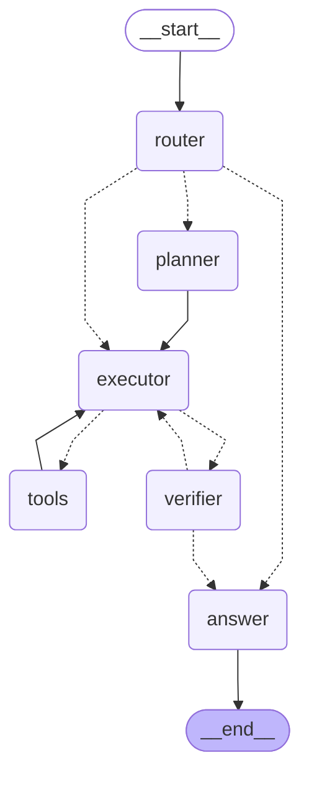

# Agent graph

The graph `talk-is-cheap ask` runs, written by `talk-is-cheap agent-graph`. Dotted edges are conditional. How each node works is in [agent.md](agent.md).

```mermaid
---
config:
  flowchart:
    curve: linear
---
graph TD;
	__start__([<p>__start__</p>]):::first
	router(router)
	planner(planner)
	executor(executor)
	tools(tools)
	verifier(verifier)
	answer(answer)
	__end__([<p>__end__</p>]):::last
	__start__ --> router;
	executor -.-> tools;
	executor -.-> verifier;
	planner --> executor;
	router -.-> answer;
	router -.-> executor;
	router -.-> planner;
	tools --> executor;
	verifier -.-> answer;
	verifier -.-> executor;
	answer --> __end__;
	classDef default fill:#f2f0ff,line-height:1.2
	classDef first fill-opacity:0
	classDef last fill:#bfb6fc
```
